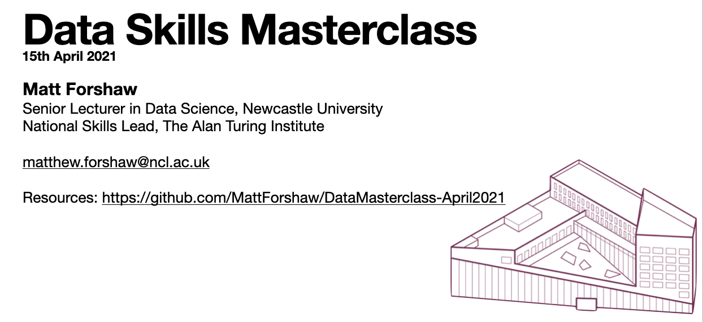

# Data Masterclass, April 2021

Slide deck as [PDF](2021_AprilDataMasterclass.pdf).

## Resources
- [Apprenticeships at Newcastle](https://www.ncl.ac.uk/work-with-us/degree-apprenticeships/)
- [AI Data Specialist Apprenticeship](https://www.instituteforapprenticeships.org/apprenticeship-standards/artificial-intelligence-(ai)-data-specialist-v1-0)
- [Scaling Up the Ethical Artificial Intelligence MSc Pipeline](https://www.bcs.org/media/3047/ethical-ai.pdf), BCS (June 2019)
- [The State of Data Science 2020: Moving from hype toward maturity](https://www.anaconda.com/state-of-data-science-2020) Anaconda (2020)
- [Data Skills Taskforce](https://www.dataskillstaskforce.com/) - Self-assessment portal for SMEs

## Questions, comments and suggestions
I would love to hear from you if you have any questions or comments. Please do not hesitate to contact me via email at matthew.forshaw@ncl.ac.uk, mforshaw@turing.ac.uk or on [Twitter](https://twitter.com/mattforshaw).
